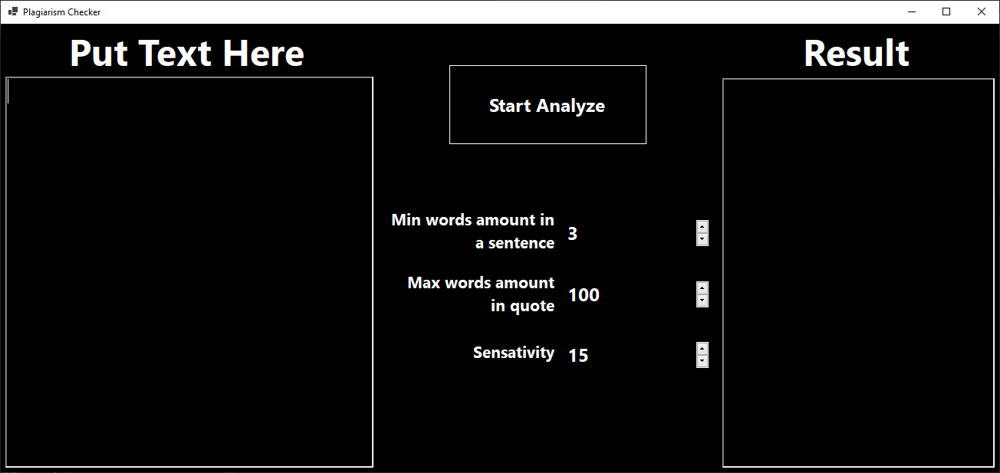
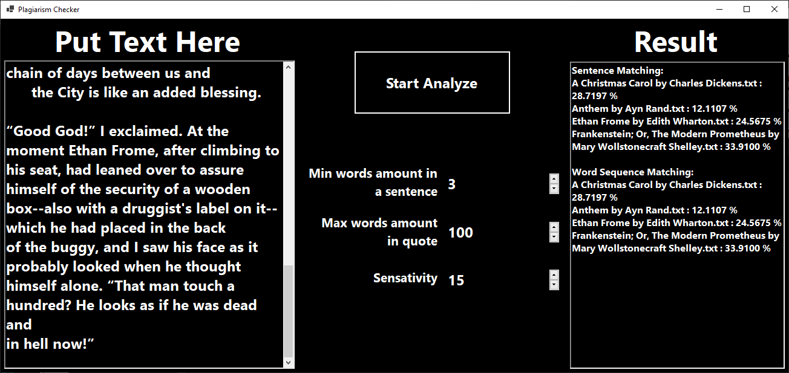

# CTnCT-Lab2
Computational Theory and Computer Technology Lab 2

## The program checks the text for plagiarism within liniar time work and liniar memory

### Application Screens:

#### Start Sreen

#### Example with Sin function

